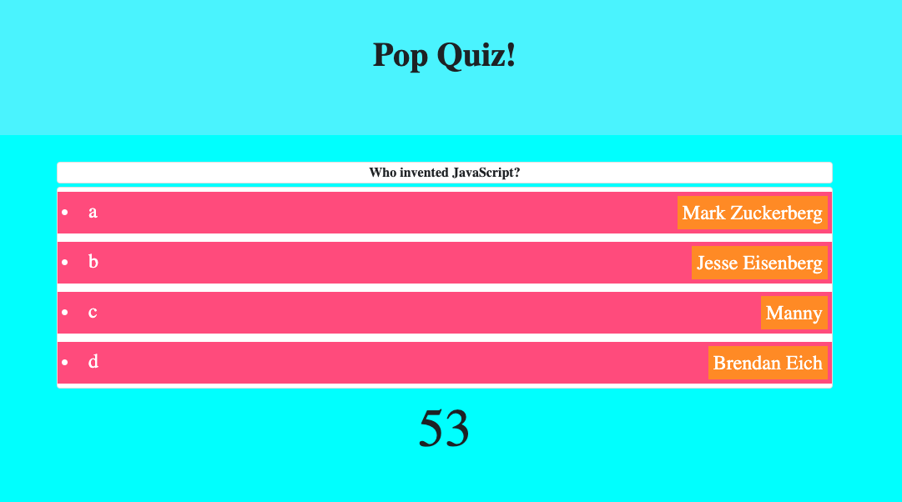

# 04 Web APIs: Code Quiz

After making sure the html was set up with the correct forms and cards I pulled from bootstrap, I used javascript with as much jQuery as I could understand to create the rules page with a start button that initiates my js. Once the start button is clicked, the first question pops up and once and answer is clicked, my score variable keeps track of correct answers and then the next question pops up. until the user is either out of time or finish all 10 questions. Also I know the assignment wanted javascript questions, but I thought these were a little more fun, so I hope you enjoy them and I hope my grade doesn't go down for that.

## Technologies

html
javascript
css
jQuery
Bootstrap

## Deployed

Website:
https://asegre18.github.io/hw4-quiz-game/

GitHub Repo:
https://github.com/asegre18/hw4-quiz-game

Screenshot of Website:

